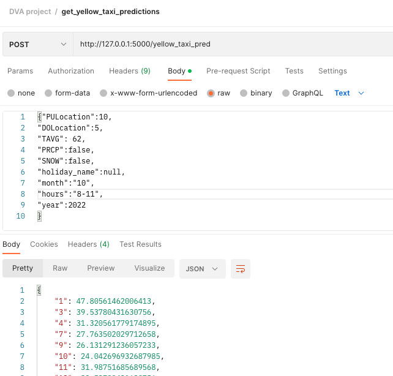

# Backend Server
## Run instructions
To run the backend:
- Navigate to the `Back-end` folder
- In the terminal type: ```python -m app```

This will spin up the backend server, and you should get the following output in the terminal
```
Backend starting
 * Serving Flask app "app" (lazy loading)
 * Environment: production
   WARNING: This is a development server. Do not use it in a production deployment.
   Use a production WSGI server instead.
 * Debug mode: off
 * Running on http://127.0.0.1:5000/ (Press CTRL+C to quit)
```

 ## Testing Instructions
 To test the backend, I would recommend using an agent like Postman to make POST requests. An example of this would be:
 

 A few important things:
 - To get predictions, it needs to be a **POST** request
 - The Body should contain data json parseable data valid for the model (more on this later)
 - predictions will be returned as a json dictionary with DOLocationID and the distance in **minutes**

## Input Data
The model currently requires the following input data:
- PULocationID: any valid integer occuring in the dataset
- DOLocationID: Not necessarily needed, but kept just in case
- TAVG: A valid integer value
- PRCP: boolean
- SNOW: boolean
- holiday_name: string and one of the following: `['None', 'Martin Luther King Jr. Day', 'Christmas Eve',
       'Christmas Day', "Mother's Day", 'Halloween', 'Labor Day',
       "Valentine's Day", "Father's Day", 'Columbus Day',
       "New Year's Eve", 'Easter Sunday', 'Memorial Day',
       'Independence Day', "St. Patrick's Day", "New Year's Day",
       "Washington's Birthday", 'Administrative Professionals Day',
       'Tax Day', 'Day after Thanksgiving Day', 'Election Day',
       'Veterans Day', 'Thanksgiving Day',
       'Independence Day (substitute day)',
       'Christmas Day (substitute day)', 'Juneteenth',
       'Juneteenth (substitute day)', "New Year's Day (substitute day)"]`
- month: string between 1 to 12 (these are converted to booleans, so having it as a string is important)
- hours: string. One of the following: `['19-22', '22-8', '8-11', '11-16', '16-19']`
- year: int - keep it to 2022 for now

Here is an example to copy paste into POSTMAN:
```
{"PULocation":10,
"DOLocation":5,
"TAVG": 62,
"PRCP":true,
"SNOW":false,
"holiday_name":null,
"month":"10",
"hours":"19-22",
"year":2022
}
```

## Results

The results are returned in two ways:
- The json is returned through the server
- A json file is written in `DVA-Project-Team-21/Front-end/index/taxi_predictions.json`
  
Several Boroughs would be missing if we do not have any data to estimate the distance between them. A workaround would eventually be needed to fix missing distances.